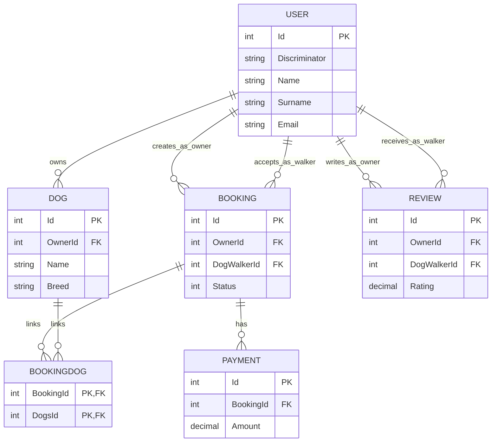

# Semantic Model

Last verified: 2026-05-07 against `Vjezba.Model/Data/ApplicationDbContext.cs` and `Vjezba.Model/Migrations/ApplicationDbContextModelSnapshot.cs`.

## Short Architecture Overview
- Application style: ASP.NET Core MVC with repository abstractions over EF Core.
- Persistence: EF Core code-first model in `ApplicationDbContext` with SQL Server provider.
- Mapping style: convention + explicit Fluent API configuration (FK behavior, precision, many-to-many join table).
- Inheritance: `User` base type with `DogOwner` and `DogWalker` derived types stored using TPH (`User` table + `Discriminator`).

## ER Diagram (Compact)

## Entity/Table Template
- Entity: CLR type used in domain model.
- Table: physical table name in database schema.
- Key properties: core business-relevant columns.
- PK: primary key.
- FKs: foreign keys owned by this entity/table.
- Relationships: cardinality and navigation direction.

---

## User (base), DogOwner (derived), DogWalker (derived)
- Entity: `User` (base), `DogOwner`, `DogWalker`
- Table: `User` (TPH)
- Key properties:
  - Base: `Name`, `Surname`, `Email`, `PhoneNumber`, `Address`
  - Derived (`DogWalker`): `HourlyRate`
  - Inheritance marker: `Discriminator` (`DogOwner`, `DogWalker`)
- PK: `Id`
- FKs: none owned directly on `User`
- Relationships:
  - `DogOwner` 1-N `Dog` via `Dog.OwnerId`
  - `DogOwner` 1-N `Booking` via `Booking.OwnerId`
  - `DogWalker` 1-N `Booking` via `Booking.DogWalkerId`
  - `DogWalker` 1-N `Review` via `Review.DogWalkerId`
  - `DogOwner` 1-N `Review` via `Review.OwnerId` (inverse navigation not exposed on `DogOwner`)

## Dog
- Entity: `Dog`
- Table: `Dogs`
- Key properties: `Name`, `Breed`, `Age`, `IsVaccinated`, `IsFriendly`
- PK: `Id`
- FKs:
  - `OwnerId` -> `User.Id` (domain intent: owner is `DogOwner`; DB FK itself is to `User`)
- Relationships:
  - N-1 `DogOwner` (`Dog.Owner`)
  - N-N `Booking` through join table `BookingDog`

## Booking
- Entity: `Booking`
- Table: `Bookings`
- Key properties: `StartTime`, `EndTime`, `Status` (`BookingStatus` enum)
- PK: `Id`
- FKs:
  - `OwnerId` -> `User.Id` (domain intent: owner is `DogOwner`; DB FK itself is to `User`)
  - `DogWalkerId` -> `User.Id` (domain intent: walker is `DogWalker`; DB FK itself is to `User`)
- Relationships:
  - N-1 `DogOwner` (`Booking.Owner`)
  - N-1 `DogWalker` (`Booking.DogWalker`)
  - 1-N `Payment` (`Booking.Payments`)
  - N-N `Dog` through `BookingDog`

## BookingDog (join table)
- Entity: implicit join entity (`UsingEntity<Dictionary<string, object>>`)
- Table: `BookingDog`
- Key properties: none beyond composite key columns
- PK: composite (`BookingId`, `DogsId`)
- FKs:
  - `BookingId` -> `Bookings.Id` (cascade delete)
  - `DogsId` -> `Dogs.Id` (cascade delete)
- Relationships:
  - Resolves N-N between `Booking` and `Dog`

## Payment
- Entity: `Payment`
- Table: `Payments`
- Key properties: `Amount` (decimal 18,2), `Date`, `PaymentMethod`, `IsSuccessful`
- PK: `Id`
- FKs:
  - `BookingId` -> `Bookings.Id`
- Relationships:
  - N-1 `Booking` (`Payment.Booking`)

## Review
- Entity: `Review`
- Table: `Reviews`
- Key properties: `Rating` (decimal 18,2), `Comment`, `Date`
- PK: `Id`
- FKs:
  - `OwnerId` -> `User.Id` (domain intent: owner is `DogOwner`; DB FK itself is to `User`)
  - `DogWalkerId` -> `User.Id` (domain intent: walker is `DogWalker`; DB FK itself is to `User`)
- Relationships:
  - N-1 `DogOwner` (`Review.Owner`)
  - N-1 `DogWalker` (`Review.DogWalker`)

## Delete Behavior Summary
- Restrict delete on direct business relationships:
  - `Dog -> Owner`
  - `Booking -> Owner`
  - `Booking -> DogWalker`
  - `Payment -> Booking`
  - `Review -> Owner`
  - `Review -> DogWalker`
- Cascade delete on many-to-many join edges in `BookingDog`.

## BookingStatus Enum Meanings
- `Pending`: booking created, waiting for walker confirmation/processing.
- `Confirmed`: booking accepted and scheduled.
- `Completed`: walk has finished successfully.
- `Cancelled`: booking was cancelled before completion.

## Business Constraints and Notes
- Enforced in schema/config:
  - Relationship integrity through FKs.
  - Decimal precision for monetary/rating fields (`Amount`, `HourlyRate`, `Rating`) as (18,2).
  - Restrictive delete behavior for core business relationships.
- Important constraints not currently enforced at DB/model level:
  - No explicit rule ensuring `StartTime < EndTime` on `Booking`.
  - No uniqueness constraint on `User.Email`.
  - Subtype intent (`DogOwner` vs `DogWalker`) is not enforced by a dedicated FK target table; FKs point to `User` and rely on discriminator/domain logic.
  - No model link between `Review` and `Booking`, so "one review per booking" cannot be enforced with current schema.

## Indexing and Performance Notes
- Present indexes (from current migration):
  - `Bookings`: indexes on `DogWalkerId`, `OwnerId`.
  - `Dogs`: index on `OwnerId`.
  - `Payments`: index on `BookingId`.
  - `Reviews`: indexes on `DogWalkerId`, `OwnerId`.
  - `BookingDog`: PK composite (`BookingId`, `DogsId`) plus index on `DogsId`.
- Practical impact:
  - FK lookups and common relationship joins are covered.
  - If email-based lookup/auth is introduced, add an index (or unique index) on `User.Email`.